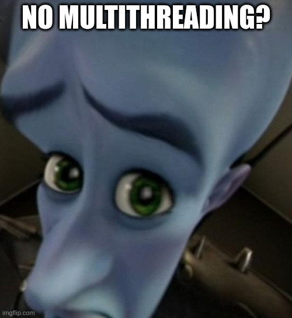

Description
===

A program which should demonstrate cooperative multitasking in Python.      
It does that using a example event loop executing generators, which could be interpreted as coroutines in a way, in a round robin fashion. A very similar approach, more complicated and thought out of course, is implemented under the hood of pythons asyncio. Asyncio uses actual coroutines and handles blocking I/O tho, I haven't had time to demonstrate those concepts also or create a meaningful application using them.

Context
===

**Cooperative multitasking** is a programming concept used in concurrent task processing. It revolves around an **idea of a process itself knowing the best, when it blocks a can let other processes run**. So the running process gives a signal to the underlying scheduler or event loop, that it will wait, so other process can be scheduled, or, if the programmer of the task was clever enough, the program will let other program run simply after it runs for long enough time.          
In the old times, for example in very old Windows, the OS scheduler used this strategy for multitasking. Which was not all too smart, since you can never trust programmers to write respectful programs, which will let other ones run. You can surely see the problem now. Some processes might not get their turn to run at all. Modern operating systems thus use preemptive multitasking. That basically means that the scheduler decides when to run which process.       
But **cooperative multitasking** is still used in some places. For example in the Python programming language. Put very simply Python has this thing called GIL (Global Interpreter Lock). Which is used in interpreted programming languages for code synchronization or whatever. In simple terms, only one thread will run at one time.



Note that this does not mean Python is incapable of multithreading, it is just, without raping the language, unable to run threads in parallel. Well, how can I run anything asynchronously then? Thats the thing. Python very cleverly uses the concept of coroutines, which I won't bother to explain. The asyncio library has an event loop which runs every async function as a coroutine and uses **cooperative multitasking** to achieve asynchronous excecution of those tasks. For more in depth explanation, I recommend the article from Victor Skvortsov I include in *Sources*.

How to use
===

I am using **Python 3.13.0**. So just execute *main.py* with a compatible python version like this:

```bash
python main.py
```

The application itself won't do too much, it is just supposed to demonstrate the concept of cooperative multitasking.

Sources
===

NeuralNine - AsyncIO & Asynchronous Programming in Python - *https://www.youtube.com/watch?v=6RbJYN7SoRs&t=659s*      
Victor Skvortsov - Python behind the scenes #12: how async/await works in Python - *https://tenthousandmeters.com/blog/python-behind-the-scenes-12-how-asyncawait-works-in-python/*     
OSDev - Multitasking Systems - https://wiki.osdev.org/Multitasking_Systems